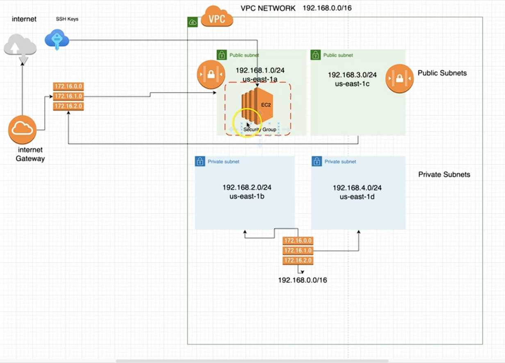

## AWS EC2 instance(Apache Web Server)

## Creating EC2 Web Server using terraform. IaC include:
* VPC
* Security group
* EC2 Instance(deployed on public subnet)
* httpd

## Prerequisites

* AWS Account
* AWS IAM User/Profile
* [Deployed AWS VPC](https://github.com/mariuszbrozda/AWS-VPC-Terraform)
* Created ssh-key-pair

## High Level Diagram


## Instructions to deploy EC2 Instance
### Clone repository

```bash
git clone https://github.com/mariuszbrozda/AWS-EC2-Terraform.git AWS-EC2-Terraform

```
### Setup AWS Profile credentials

```bash
aws configure --profile profilename
```
Provide access_key, secret_key and region(exported during IAM user keypair setup)

### Deploy AWS resources

#### Init working directory

```bash
cd AWS-EC2-Terraform && terraform init
```

#### Format and validate configuration

```bash
terraform fmt && terraform validate
```

#### Plan and apply AWS resources
```bash
terraform plan
terraform apply
```
